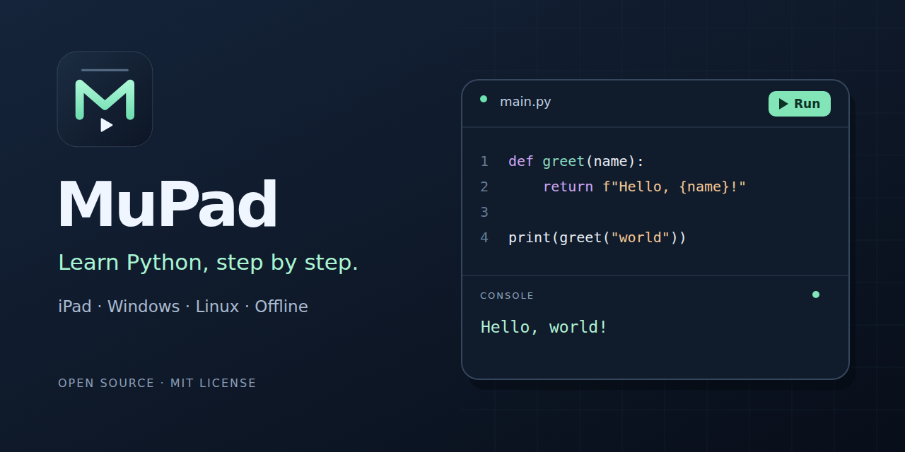
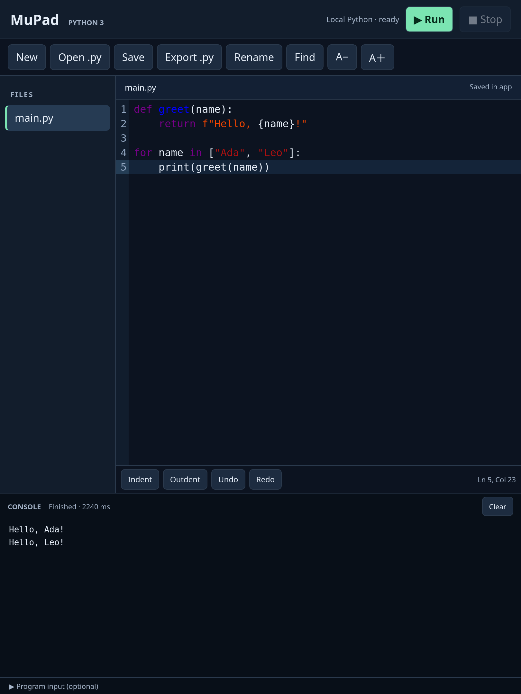

# MuPad

**Learn Python, one small project at a time.** MuPad is a friendly Python editor and learning app for iPad, Windows and Linux. Start with your first `print()`, work through guided exercises, and keep using the same editor as your projects grow.

The interpreter ships with the app. You don't need to set up Python, create an account, or send your code to a server. It runs real CPython 3.14.2 through [Pyodide](https://pyodide.org/), including normal synchronous `input()`.

## Download

[**Get the latest version from Releases**](https://github.com/leopoldthu3-hash/mupad/releases/latest)

Under **Assets**, choose the download for your device:

- **Windows 10/11, x64:** the `.exe` installer.
- **Linux, x64:** `.deb` for Debian/Ubuntu, or `.AppImage` for other compatible distributions. An AppImage must be made executable before opening; it may need your distribution's FUSE compatibility package.
- **iPad (iPadOS 17+):** the `.ipa`. It is **unsigned**, so it must be signed through your own sideloading setup. This is not an App Store or TestFlight download.

Desktop packages are not developer-signed either. Check the release URL and the supplied **SHA256SUMS.txt** before installing; Windows may show an unknown-publisher/SmartScreen warning. Do not turn off your computer's security protections to run the app. Downloads don't require a GitHub account.

Export important scripts before replacing or removing an installation. Each release records the exact source commit used for its builds.

## Built for learning

- **Start guide:** learn the editor, files, Run/Stop, output, `input()`, and how to save a script outside the app.
- **Six courses, 36 practical lessons:** start with printing, values and input; move through decisions, loops, collections, functions, files and more challenging projects.
- **Explanation + working example + your own exercise** in every lesson.
- **Hints and optional solutions:** try first, then reveal help when you need it.
- **Check your work:** checks execute real Python and test the answer. Opening a lesson or clicking a button doesn't mark it complete.
- **Local progress:** completed exercises stay on your device. There is no learning account or cloud tracking.
- **Friendlier error help:** common Python exceptions keep their original traceback and get a short explanation of what to check.
- **Full-screen console:** expand the output area for bigger programs, keep Run/Stop and input available, and return to the editor without losing your code or output.

Open **Learn Python**, choose a lesson, and load its exercise. MuPad creates a separate exercise file instead of overwriting your current script. Edit it, experiment with **Run**, and use **Check exercise** when you're ready. Courses and solutions are in English; Python syntax is ordinary Python.

## Still a useful editor

Create, rename, import and export `.py` files. Drafts save automatically. The editor includes syntax highlighting, line numbers, four-space indentation, search, and undo/redo. Run scripts locally, import another workspace file, watch output live, or stop an infinite loop without locking up the interface.



*Editor screenshot from the earlier 0.2 release, running in iPad-sized WebKit. The 0.3 learning interface adds controls around the same editor.*

## A few limits

MuPad is a learning app, not every desktop Python environment. Its WebAssembly interpreter doesn't support desktop GUI libraries such as `tkinter`, graphical `turtle`, pygame, hardware-specific modules, or arbitrary native packages. There is not a full REPL, debugger, or plotter yet.

Each run starts a fresh interpreter. Editor files persist, but files created by a running script are currently temporary. Saving a draft is not the same as exporting it: export anything important before deleting or reinstalling the app. Progress stays local to each installation; it is not synced between devices.

## Develop and test

You'll need Node.js 22+ and Python 3. Native iOS builds additionally require macOS and Xcode 26+.

```sh
git clone https://github.com/leopoldthu3-hash/mupad.git
cd mupad
npm ci
npm run bundle
npm run check
npx playwright install --with-deps chromium webkit
npm run test:e2e
```

For a browser development session, run `python3 scripts/test-server.py` and open **http://127.0.0.1:4192**. Keep the server on localhost; its isolation headers enable interactive input.

For the desktop app:

```sh
npm run desktop
npm run build:windows  # use a Windows build machine
npm run build:linux    # use a Linux build machine
```

The desktop wrapper uses Electron with sandboxing, context isolation, and no renderer Node access. A bundled custom origin serves the editor/interpreter, and remote app requests/navigation are blocked. Python still runs in a separate worker; it does not get direct access to your operating system.

For iPad:

```sh
npx cap add ios
npx cap sync ios
node scripts/prepare-native.mjs
npx cap open ios
```

The reproducible native preparation applies the local input bridge, app icon, and version metadata. The generated `ios/` directory is not committed; its custom Swift sources are in `native/`. On iPad, ordinary `input()` uses a native prompt through a loopback-only HTTP bridge with a random per-launch path. No Python code is sent away for execution.

The GitHub Actions workflows build on native Windows, Linux and macOS hosts. Release gates exercise packaged desktop Python/input/Stop/restart/storage and the native iPad simulator. Browser checks cover portrait/landscape layouts and the learning interface, and a separate test executes all course solutions using the bundled Python interpreter. A successful compile alone is not a passing app test.

## Contributing and license

Pull requests are welcome: better explanations, tested exercises, accessibility improvements, and small editor fixes are good places to start. See [CONTRIBUTING.md](CONTRIBUTING.md). Please don't commit credentials, signing material, personal scripts, or generated build artifacts.

Original MuPad code and artwork use the [MIT license](LICENSE). Dependencies retain their own licenses; see [THIRD_PARTY_NOTICES.md](THIRD_PARTY_NOTICES.md).

MuPad takes inspiration from [Mu Editor](https://codewith.mu/), but has its own code, interface, and branding. It is not affiliated with the Mu Editor project.
